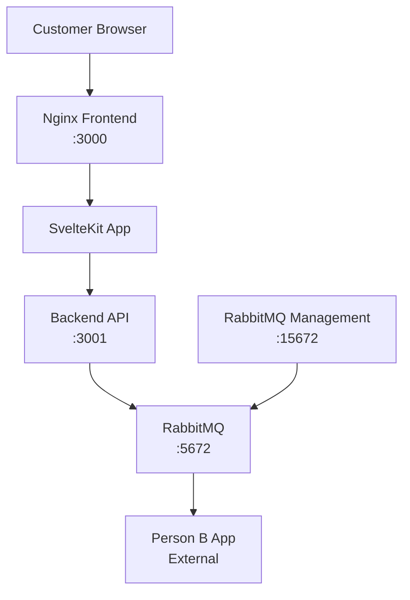

# Customer Ordering App

This is a **Customer Ordering App** for a two-person project demonstrating inter-application communication using **RabbitMQ**.

Built with **SvelteKit + TypeScript** for the frontend and **Node.js + TypeScript + Express** for the backend, this system allows users to place simple food and drink orders which are sent to another system (Person B) via RabbitMQ.

🐳 **Fully Dockerized** - The entire application stack runs in Docker containers for easy deployment and development.

## Overview

This app is part of a two-part system:

- 👤 **Person A (this repo)** – Customer-facing web app for placing orders.
- 👤 **Person B** – Kitchen Dashboard or CLI app that receives the orders.

The two apps communicate via RabbitMQ using a shared `orders` message queue.

## Features

- 🌐 Modern SvelteKit frontend with static generation
- 🔧 TypeScript backend with Express.js
- 📨 RabbitMQ message queue for order processing
- 🐳 Complete Docker containerization
- 🌐 Nginx reverse proxy for production-ready frontend
- 📊 RabbitMQ Management UI for monitoring

## Tech Stack

- **Frontend:** SvelteKit + TypeScript + Vite
- **Backend:** Node.js + TypeScript + Express
- **Messaging:** RabbitMQ (`amqplib`)
- **Containerization:** Docker + Docker Compose
- **Web Server:** Nginx (for frontend)
- **Development:** Hot reload enabled

## Quick Start

### Prerequisites
- Docker Desktop installed and running
- Git

### Launch the Application

1. **Clone the repository:**
   ```bash
   git clone <your-repo-url>
   cd ordering-app
   ```

2. **Start the entire application stack:**
   ```bash
   docker compose up -d
   ```

3. **Access the application:**
   - 🌐 **Frontend**: http://localhost:3000
   - 🔧 **Backend API**: http://localhost:3001
   - 📊 **RabbitMQ Management**: http://localhost:15672 (admin/admin)

That's it! The entire application is now running in Docker containers.

## Application URLs

| Service | URL | Description |
|---------|-----|-------------|
| Frontend | http://localhost:3000 | Customer ordering interface |
| Backend API | http://localhost:3001 | REST API endpoints |
| RabbitMQ Management | http://localhost:15672 | Queue monitoring (admin/admin) |

## API Endpoints

### POST /api/order
Place a new order.

**Request:**
```json
{
  "name": "pizza",
  "quantity": 2
}
```

**Response:**
```json
{
  "message": "Order received"
}
```

**Example:**
```bash
curl -X POST http://localhost:3001/api/order \
     -H "Content-Type: application/json" \
     -d '{"name":"pizza","quantity":2}'
```

## Development Commands

```bash
# Start the application
docker compose up -d

# Stop the application
docker compose down

# View logs
docker logs ordering-frontend
docker logs ordering-backend
docker logs ordering-rabbitmq

# Rebuild and restart (after code changes)
docker compose up --build -d

# Follow logs in real-time
docker compose logs -f
```

## Project Structure

```
ordering-app/
├── docker-compose.yml          # Orchestrates all services
├── DOCKER.md                   # Docker documentation
├── README.md                   # This file
├── backend/
│   ├── Dockerfile              # Backend container config
│   ├── server.ts               # TypeScript backend server
│   ├── package.json            # Node.js dependencies
│   ├── tsconfig.json           # TypeScript config
│   └── .dockerignore           # Docker build exclusions
└── frontend/
    ├── Dockerfile              # Multi-stage frontend build
    ├── nginx.conf              # Nginx configuration
    ├── svelte.config.js        # SvelteKit static adapter
    ├── package.json            # Frontend dependencies
    ├── src/
    │   ├── routes/
    │   │   ├── +layout.ts      # Prerender configuration
    │   │   └── +page.svelte    # Main ordering page
    │   └── ...
    └── .dockerignore           # Docker build exclusions
```

## Architecture



## Message Format

Orders are sent to RabbitMQ in the following JSON format:

```json
{
  "name": "item_name",
  "quantity": number
}
```

## Troubleshooting

### RabbitMQ Management Login Issues
If you get "not_authorized" when logging into RabbitMQ Management UI:

1. **Use correct credentials**: Username: `admin`, Password: `admin`
2. **Clear browser cache** or try in incognito/private mode
3. **Wait for RabbitMQ to fully start**:
   ```bash
   docker logs ordering-rabbitmq --tail 10
   ```
   Look for "Server startup complete" message
4. **Verify user exists**:
   ```bash
   docker exec ordering-rabbitmq rabbitmqctl list_users
   ```
5. **Reset RabbitMQ if needed**:
   ```bash
   docker compose down
   docker volume rm ordering-app_rabbitmq_data
   docker compose up -d
   ```

### Port Conflicts
If you get port conflicts, make sure no other services are running on ports 3000, 3001, 5672, or 15672.

### RabbitMQ Connection Issues
Check the backend logs:
```bash
docker logs ordering-backend
```
Look for "✅ Connected to RabbitMQ" messages.

### Frontend Not Loading
Check if the frontend container is running:
```bash
docker ps
```
And check nginx logs:
```bash
docker logs ordering-frontend
```

## For Person B (Message Consumer)

To consume messages from the RabbitMQ queue in your separate application:

1. Connect to RabbitMQ at `localhost:5672`
2. Use credentials: `admin/admin`
3. Listen to the `orders` queue
4. Process incoming JSON messages

## Contributing

1. Make your changes
2. Rebuild the containers: `docker compose up --build -d`
3. Test the functionality
4. Submit your changes

## License

This project is for educational purposes.
